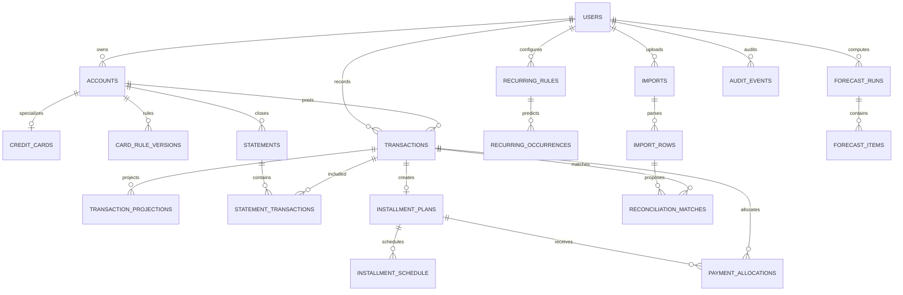

# Data Model v0.2

## Source-of-truth hierarchy
1. Canonical transaction events.
2. Reconciled official statements for closed cycles.
3. Explicit debt-plan terms and allocations.
4. Deterministic projections for open/future cycles.
5. Forecast assumptions.

A forecast never overwrites historical facts. A PDF import never writes directly into canonical transactions before reconciliation.

## Money semantics
- `purchase` / `subscription` / `fee` / `interest` can represent economic expense.
- `payment` and `transfer` move money but are not new consumption.
- `refund` reverses prior consumption.
- MSI preserves original purchase date/category while creating future payment obligations.
- Extra debt payments are allocated to principal explicitly.

## Statement inconsistencies
`statements.data_quality` and `metadata` preserve discrepancies instead of silently forcing a number to fit. For example, the initial Joy and Nu source statements contain values that do not fully reconcile at plan level, so the seed marks those snapshots `inconsistent` while preserving the official/derived figures.
